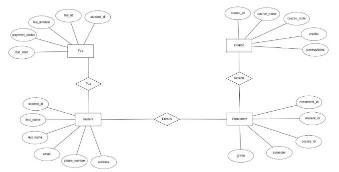
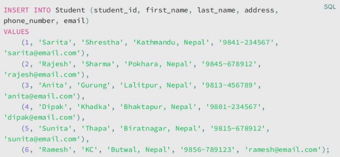

**TEXAS COLLEGE OF MANAGEMENT & IT![ref1]**

DEPARTMENT OF INFORMATION TECHNOLOGY Database Management System

Project Name : texas\_DBMS\_3rd\_sem

Submitted By : Gauranga Gautam

Submitted To : Sushil Bhattarai

ㅤ ㅤ ㅤ ㅤ ㅤ ㅤ ㅤ ㅤ ㅤ ㅤ ㅤ

ㅤ ㅤ ㅤ ㅤ ㅤ ㅤ ㅤ

ㅤ ㅤ ㅤ ㅤ ㅤ

**Table of Contents**

1. Introduction
1. Database Design

Tables

Relationships

Entity-Relationship Diagram (ERD)

3. Database Implementation

Create Tables

Student Table

 Course Table

Enrollment Table

Fee Table

4. Insert Data into Tables

Insert into Student Table Insert into Course Table Insert into Enrollment Table Insert into Fee Table

5. Read Data

Aggregate Functions

Joins

6. Conclusion

Recommendations

7. References

ㅤ ㅤ ㅤ ㅤ ㅤ ㅤ ㅤ ㅤ ㅤ ㅤ

**1. Introduction**

|
The purpose of this report is to outline the significance of the database project for Texas College of Management and IT. This project aims to improve data management, streamline processes, and enhance overall efficiency at the college.

**2. Database Design**
|
| :- |
|**MySQL**|
|
MySQL is an open-source relational database management system. It is widely used for storing, organizing, and retrieving data. MySQL uses Structured Query Language (SQL) to interact with the database. It offers features like data security, scalability, and high performance. MySQL is commonly used for web applications, and it can be accessed and managed through command-line tools or graphical interfaces.

**Tables**
|
|
 **Student Table:** - Columns: student\_id (Primary Key), name, address, phone\_number, email

 **Course Table:** - Columns: course\_id (Primary Key), course\_name, course\_code, credits, prerequisites

 **Enrollment Table:** - Columns: enrollment\_id (Primary Key), student\_id (Foreign Key), course\_id (Foreign Key), semester, grade

 **Fee Table:** - Columns: fee\_id (Primary Key), student\_id (Foreign Key), fee\_amount, due\_date, payment\_status

**Relationships**
|
|
 Student to Enrollment: One-to-Many relationship (One student can enroll in many courses).

 Course to Enrollment: One-to-Many relationship (One course can have many enrollments).

 Student to Fee: One-to-Many relationship (One student can have multiple fee records).

**Entity-Relationship Diagram (ERD)**
|

3. **Database Implementation**

**Create Tables**

**Student Table:**

 Columns: student\_id (Primary Key), first\_name, last\_name, address, phone\_number, email

**Breakdown of Student Table**

 **student\_id** (INT): Unique identifier, auto-increment, and primary key.

- **first\_name** (VARCHAR(255)): Student's first name.
  - **last\_name** (VARCHAR(255)): Student's last name.
    - **address** (VARCHAR(255)): Student's address.
      - **phone\_number** (VARCHAR(20)): Student's phone number.
        - **email** (VARCHAR(255)): Student's email address.

**Course Table**

 Columns: course\_id (Primary Key), course\_name, course\_code, credits, prerequisites

**Breakdown of Course Table**

- "course\_id" (INT): Unique identifier, auto-increment, and primary key.
  - "course\_name" (VARCHAR(255)): Name of the course.
    - "course\_code" (VARCHAR(10)): Code or identifier for the course.
      - "credits" (INT): Number of credits assigned to the course.
        - "prerequisites" (VARCHAR(255)): Any prerequisites or requirements for the course.

**Enrollment Table:**

 Columns: enrollment\_id (Primary Key), student\_id (Foreign Key), course\_id (Foreign Key), semester, grade

**Breakdown of Enrollment Table**

|
 **Columns:**

 "enrollment\_id" (INT): Unique identifier, auto-increment, and primary key.

 "student\_id" (INT): Foreign key referencing the "student\_id" in the "Student" table.

 "course\_id" (INT): Foreign key referencing the "course\_id" in the "Course" table.

 "semester" (VARCHAR(20)): The semester in which the enrollment occurred.

 "grade" (VARCHAR(2)): The grade achieved in the course.

 **Foreign Key Constraints:**

 "student\_id" references the "student\_id" column in the "Student" table.

 "course\_id" references the "course\_id" column in the "Course" table.

**Fee Table:**
|
| - |
|
 Columns: fee\_id (Primary Key), student\_id (Foreign Key), fee\_amount, due\_date, payment\_status

**Breakdown of Fee Table**
|

- **Columns:**
  - "fee\_id" (INT): Unique identifier, auto-increment, and primary key.
    - "student\_id" (INT): Foreign key referencing the "student\_id" in the "Student" table.
      - "fee\_amount" (DECIMAL(10, 2)): The amount of the fee with two decimal places.
        - "due\_date" (DATE): The date by which the fee is due.
          - "payment\_status" (VARCHAR(20)): The status of the fee payment.
  - **Foreign Key Constraint:**
    - "student\_id" references the "student\_id" column in the "Student" table.

4. **Insert Data into Tables**

**Insert into Student Table:**

**Breakdown of Insert into Student Table**

 In this code, each row in the "Student" table is defined by its own 'INSERT INTO' statement. The 'VALUES' keyword is used to specify the columns (student\_id, first\_name,

last\_name, address, phone\_number, and email) and provide the corresponding data for each row.

**Insert into Course Table:**

**Breakdown of Insert into Course Table**

 The columns (course\_id, course\_name, course\_code, credits, and prerequisites) and the pertinent information for each course are specified using the 'VALUES' keyword. We can effectively add the data required for each course to the 'Course' table using this process.

**Insert into Enrollment Table:**

**Breakdown of Insert into Enrollment Table:**

 Each enrollment record in the table is represented by an individual 'INSERT INTO' statement. The 'VALUES' keyword is utilized to specify the columns (enrollment\_id, student\_id, course\_id, semester, and grade) and to provide the corresponding data for each enrollment. This process allows us to efficiently populate the 'Enrollment' table with enrollment details for different students in various courses during the Fall 2023 semester, including their respective grades.

**Insert into Fee Table:**

**Breakdown of Insert into Fee Table![ref1]**

 The 'VALUES' keyword is used to specify the columns (fee\_id, student\_id, fee\_amount, due\_date, and payment\_status) and associated information for each fee record. By following this process, the 'Fee' table can be efficiently filled with financial information for different students, such as the fee amount, due date, and payment status.

5. **Read Data**

**Aggregate Functions**

In SQL, **aggregate functions** are used to perform calculations on sets of values within a group of rows, typically in a result set produced by a SELECT statement. These functions allow you to summarize and analyze data by calculating values such as sums, averages, counts, maximums, and minimums. Aggregate functions operate on a set of rows and return a single value as the result. They are essential for data analysis and reporting.

**Types of Aggregate Functions:**

1. **SUM**:

The  SUM function determines the total value by adding up all the values in a numeric column.

Example:  SELECT COUNT(\*) AS Total\_Students FROM Student;

2. **AVG** (Average):

The  AVG function determines the average (mean) value of a numeric column and outputs that value.

Example:  SELECT AVG(LENGTH(email)) AS Average\_Email\_Length FROM Student;

3. **COUNT**:

The  COUNT function calculates the count by counting the number of columns or non- null values in a row.

Example:  SELECT COUNT(phone\_number) AS Students\_With\_Phone FROM Student;

4. **MAX** (Maximum):

The  MAX function returns the maximum value by locating the highest value within a column.

Example:  SELECT MAX(student\_id) AS Max\_Student\_ID FROM Student;

5. **MIN** (Minimum):

The  MIN function returns the minimum value by locating the lowest value within a column.

 Example:  SELECT MIN(LENGTH(address)) AS Min\_Address\_Length FROM Student;

**Joins**

 **INNER JOIN**: When there is a match based on the "student\_id" column, an INNER JOIN is used to combine the data from the "Student" and "Fee" tables.

 **LEFT JOIN**: All "Student" rows and related "Fee" rows are combined using an LEFT JOIN. When there is no match in "Fee," the "Student" data is retained with NULL values in the "Fee" columns.

 **RIGHT JOIN**: Similar to an LEFT JOIN, a RIGHT JOIN keeps all "Fee" rows and any matching "Student" rows. If there is no match in "Student," the "Fee" data is retained with NULL values in the "Student"

ㅤ

 **FULL OUTER JOIN**: All rows from both the "Student" and the "Fee" tables are included in a FULL OUTER JOIN. Where no match is found, it returns NULL values instead of matching data.

6. **Conclusion**

The goal of this project is to create and put into use a well-organized database with four main tables: Student, Course, Enrollment, and Fee. These tables are linked together to manage student records, course information, enrollments, and financial transactions effectively while preserving the accuracy and accessibility of the data.

The database is now fully populated thanks to data insertion, making data administration and retrieval more effective. The ability to analyze data in-depth is made possible by the use of SQL joins and aggregate functions like COUNT, SUM, and AVG. In the end, this project helps the college fulfill its purpose of providing top-notch instruction and administrative effectiveness.

**Recommendations**

<table><tr><th colspan="1" rowspan="2"></th><th colspan="1" rowspan="2" valign="top"><b>1. Da</b> stu</th></tr>
<tr><td colspan="1" valign="top"><b>ta</b> de</td></tr>
<tr><td colspan="1"></td><td colspan="1" valign="top"><b>2. Er</b> me</td><td colspan="1" valign="top"><b>ro</b> ssa</td></tr>
<tr><td colspan="1"></td><td colspan="1"></td><td colspan="1"></td></tr>
<tr><td colspan="1"></td><td colspan="1" valign="bottom">
aut

<b>4. Op</b>
</td><td colspan="1" valign="bottom">ho <b>ti</b></td></tr>
<tr><td colspan="1"></td><td colspan="1" valign="bottom">for</td><td colspan="1" valign="bottom">` `im</td></tr>
</table>

**base Indexing (Opinion):** I'd create indexes on frequently queried columns (e.g., nt\_id) to enhance query performance.

**r Handling (Opinion):** I'd improve error handling to provide informative error

ges for better debugging and troubleshooting.

**rity (Opinion):** I'd strengthen database security with proper user authentication and rization mechanisms, along with data encryption for sensitive information. **mization (Opinion):** I'd regularly review and optimize database queries and schema proved performance using profiling tools to identify bottlenecks.

ㅤ ㅤ ㅤ ㅤ ㅤ ㅤ ㅤ ㅤ ㅤ ㅤ ㅤ

7. **Reference![ref1]**
- Stack Overflow ([https://stackoverflow.com)](https://stackoverflow.com/)
  - Tutorialspoint ([https://www.tutorialspoint.com)](https://www.tutorialspoint.com/)
    - Javatpoint ([https://www.javatpoint.com)](https://www.javatpoint.com/)

[ref1]: Aspose.Words.6397b881-2728-4dfe-9aa5-475595fe4fcc.001.png
